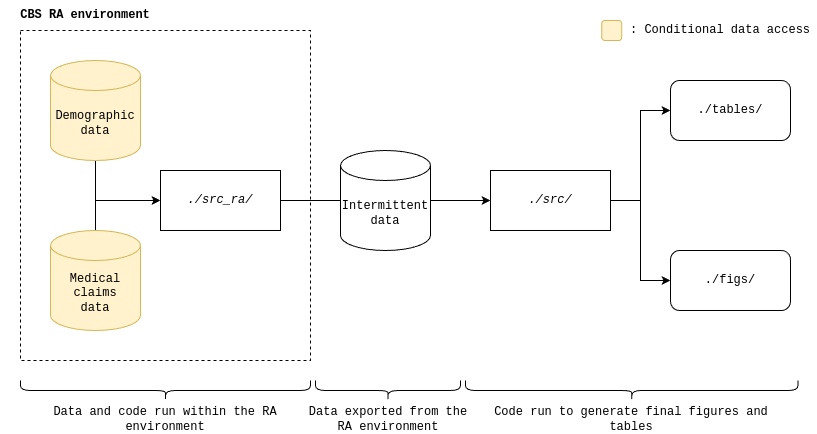

# Frey, Tilstra, and Verhagen (2023): Inequalities in Healthcare use during the COVID-19 pandemic

All results presented here are based on own calculations based on non-public registry data from Centraal Bureau voor de Statistiek (CBS)CBS, accessed through the Remote Access environment.

### Introduction

This repository contains all code underlying the results in 'Inequalities in Healthcare Use during the COVID-19 Pandemic' by Frey, Tiltra, and Verhagen (2023). The paper can be found [here](https://www.medrxiv.org/content/10.1101/2023.04.26.23289095v1).

>The COVID-19 pandemic has led to severe reductions in non-COVID related healthcare use, but little is known whether this burden is shared equally across the population. This study investigates whether the reduction in administered care disproportionately affected certain sociodemographic strata, in particular marginalised groups. Using detailed medical claims data from the Dutch universal health care system and rich registry data that cover all residents in The Netherlands, we predict expected healthcare use based on pre-pandemic trends (2017– Feb 2020) and compare these expectations with observed healthcare use in 2020. Our findings reveal a substantial 10% decline in the number of weekly treated patients in 2020 relative to prior years. Furthermore, declines in healthcare use are unequally distributed and are more pronounced for individuals below the poverty line, females, the elderly, and foreign-born individuals, with cumulative relative risk ratios ranging from 1.09 to 1.22 higher than individuals above the poverty line, males, young, and native-born. These inequalities stem predominantly from declines in middle and low urgency procedures, and indicate that the pandemic has not only had an unequal toll in terms of the direct health burden of the pandemic, but has also had a differential impact on the use of non-COVID healthcare.

### Repo structure

Preparatory analyses has been done within the Remote Access (RA) environment of Statistics Netherlands (CBS). Data access is conditional on eligibility constrains from CBS and approval from [VEKTIS](https://www.vektis.nl/) for the medical claims data. The folder `src_ra` reflects all scripts run within the RA environment and the folder `src` reflects all scripts run after data has been exported from the RA environment. See below for a flow structure:

### Remote Access Environment

All intermittent data files are generated using the scripts in the `./src_ra/` folder, ran on the RA environment of the CBS. The analysis is performed in five phases, each of which are described below.

###### Phase 0: Data preparation
The scripts assume the following data structure within the RA environment after running `00_prep_data.R`.

    └── health_access
        └── data
            └── raw
                ├── health_activities
                │   ├── MSZZorgactiviteitenVEKT2016_trim.rds
                │   ├── MSZZorgactiviteitenVEKT2017_trim.rds
                │   ├── MSZZorgactiviteitenVEKT2018_trim.rds
                │   ├── MSZZorgactiviteitenVEKT2019_trim.rds
                │   ├── MSZZorgactiviteitenVEKT2020_trim.rds
                │   └── MSZZorgactiviteitenVEKT2021_trim.rds
                ├── health_procedures
                │   ├── health_codes_2016.rds
                │   ├── health_codes_2017.rds
                │   ├── health_codes_2018.rds
                │   ├── health_codes_2019.rds
                │   ├── health_codes_2020.rds
                │   └── health_codes_2021.rds
                ├── demographics
                │   ├── 2016
                │   │   └── rin_demog_2016.rds
                │   ├── 2017
                │   │   └── rin_demog_2017.rds
                │   ├── 2018
                │   │   └── rin_demog_2018.rds
                │   ├── 2019
                │   │   └── rin_demog_2019.rds
                │   ├── 2020
                │   │   └── rin_demog_2020.rds
                │   └── 2021
                │       └── rin_demog_2021.rds
                ├── Urgentielijst medisch-specialistische zorg - 29 mei 2020.xlsx
                ├── ReflijstZorgactiviteiten.csv
                ├── LBZBASIS2020TABV1.rds
                ├── LBZBASIS2021TABV1.rds
                └── 20200319; versie 4-1F patientengroepen NZa.xlsx

After running `./src_ra/00d_identify_covid.R` additional datafiles `./data/edit/covid_dbc_ids_2020.rda` and `./data/edit/covid_dbc_ids_2021.rda` are added. These reflect all activities that are associated with a COVID-19 hospitalization.

###### Phase 1: Generate formatted yearly procedure and demographic data

Script `01_gen_data.R` generates yearly procedure and demographic data.

###### Phase 2: Merge procedure and demographic data

Script `02_merge_data.R` combines procedure and demographic data.

###### Phase 3: Generate descriptive tables

Script `03_desc_tables.R` generates demographic descriptives for each year.

###### Phase 4: Make COVID timeseries

Script `04a_make_covid_timeseries.R` makes weekly counts of individuals in hospital with COVID-19. Script `04b_make_covid_deaths.R` makes weekly counts of individuals that died with COVID-19 as main cause of death.

###### Phase 5: Generate weekly data files for export

Script `05a_gen_final_sets.R` makes activity subsets based on urgency, activity and medical subsets. Script `05b_make_activity_counts.R` generates weekly activity timeseries for age- and sex-standardized subsets.

###### Export from RA environment

The below export file has been exported from the CBS RA environment. The `data` folder is assumed to be present in the root of this repository in generating the final figures.

    └── export_file
        └── data
            ├── all_all_v3.xlsx
            ├── all_Onc_v3.xlsx
            ├── all_Trauma_v3.xlsx
            ├── RelDiag_all_v3.xlsx
            ├── RelDiag_Onc_v3.xlsx
            ├── RelDiag_Trauma_v3.xlsx
            ├── Intense_all_v3.xlsx
            ├── Intense_Onc_v3.xlsx
            ├── Intense_Trauma_v3.xlsx
            ├── dem_table_num_v3.xlsx
            ├── covid_deaths_v3.xlsx
            └── interact_table.xlsx
     
### Local scripts

To generate the plots, run `./src/main.R`. To generate the tables, run `./src/desc.R`.

